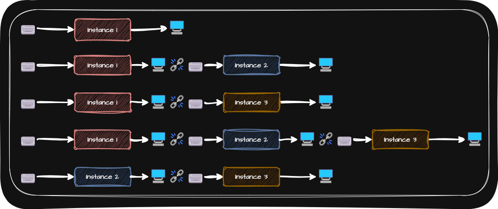

# Chain Of Responsibility (책임 연쇄 패턴)
> [!NOTE]
> 책임 연쇄 패턴은 요청을 처리할 수 있는 객체들의 체인을 따라 요청을 전달하는 패턴입니다.

- 두 가지 필수적인 기능
  - 주어진 요청을 처리하는 기능
    - 각 객체마다 나름의 방식으로 주어진 input에 대한 기능을 수행
  - 다른 객체로 연결하는 기능
    - 앞의 객체가 처리한 결과를 연결된 다음 객체로 전달하는 기능
- 책임 연쇄 패턴은 요청의 발신자와 수신자를 분리하여 여러 객체가 요청을 처리할 기회를 가지게 함으로써 객체 간의 결합도를 낮추고 요청 처리의 유연성과 확장성을 높입니다.