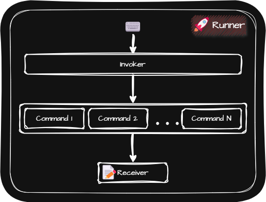

# Command(커맨드 패턴)
> [!NOTE]
> 커맨드 패턴은 명령어들을 객체로 만들어두고 이를 컬렉션에 저장하여 원하는 때에 실행, 실행 취소, 로깅 등 다양하게 활용할 수 있도록 해줍니다.

  

- 구성 요소
  - Receiver
    - Command를 받아서 실제 실행하는 클래스
    - Runner가 Invoker를 통해 Command를 실행하면 상태가 변하는 클래스  
      👉 `Light`, `TextEditor`
  - Command Interface
    - Receiver에 명령을 내리는 인터페이스  
      👉 `Command`
  - Concrete Command
    - Receiver에 명령을 내리는 클래스  
      👉 `LightOnCommand`, `LightOffCommand`, `InsertTextCommand`, `DeleteTextCommand`
  - Invoker
    - Runner의 작업 단위를 구현한 클래스
    - Runner로부터 Command를 받아서 작업단위로 실행하는 클래스
      👉 `RemoteController`, `TextEditorInvoker`
  - Runner
    - Invoker를 통해 작업  
      👉 `Client`

- Text Editor 등 각종 편집 프로그램에서 사용됨
  - 실행 취소(Undo), 다시 실행(Redo) 기능을 커맨드 패턴을 통해 구현
  - 입력이나 삭제 등의 작업이 일어나면 Undo Stack에 저장
  - Undo Stack에서 하나 꺼내어 사용(Undo) 하면 Redo Stack에 저장
  - Redo Stack에서 하나 꺼내어 사용(Redo) 하면 Undo Stack에 저장