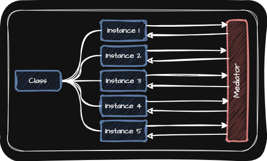

# Mediator(중재자 패턴)
> [!NOTE]
> 중재자 패턴은 이름 그대로 여러 객체들 사이에 중재자를 두는 패턴입니다.

  

- 중재자가 필요한 이유
  - 같은 타입의 여러 객체들이 서로 상호작용하며 동작하는 프로그램들에서 서로 직접적으로 연결되어 있다면 복잡한 의존관계가 맺어짐
  - 한 객체가 다수의 다른 객체를 기억해야 하고 특정 객체에 변경사항이 생기면 나머지에게도 영향을 끼침
  - 중재자 패턴은 객체들 사이에 중재자를 두어서 중재자를 통해 소통이 이루어지도록 합니다.

- 중재자 패턴의 역할
  - 객체들 간의 상호작용을 단순화하고 코드의 확장성까지 개선
  - 팻말 정도의 역할만 하는 중재자도 존재