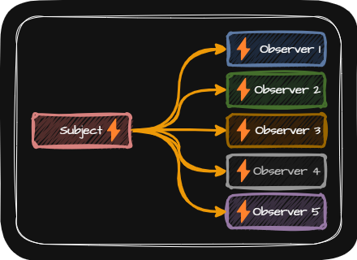

# Observer(옵저버 패턴)
> [!NOTE]
> 옵저버 패턴은 하나의 대상과 하나 이상의 관찰자들 관계에서 관찰자들이 대상에 변화가 있을 때마다 이를 통지 받고 반응하도록 설계된 패턴

  

- 사용 용도
  - 여러 주체 사이에 동적인 일대다 관계를 구현해야 할 때 옵저버 패턴이 유용하게 사용
- 장점
  - 옵저버 패턴은 객체들 간의 느슨한 결합을 유지하면서 한 서브젝트의 상태 변화를 다수의 옵저버들에게 자동으로 통제하도록 함으로써 시스템의 유연성과 확장성을 높임