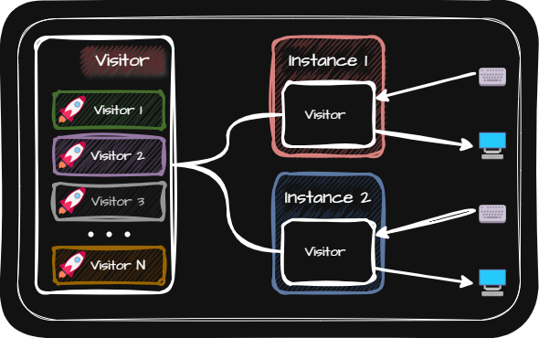

# Visitor (방문자 패턴)
> [!NOTE]
> 방문자 패턴은 기존의 클래스를 변경하지 않고도 새로운 기능을 추가할 수 있게 해줍니다.

  

- 특징
  - 방문자 패턴에서는 객체 스스로 기능을 갖는 것이 아니라 기능을 가진 방문자가 객체에 방문하여 기능을 대신 수행 할 수 있도록 합니다.
  - 그렇기 때문에 기능을 추가 하고 싶을 때 방문자를 추가적으로 만들면 다양한 기능을 수행할 수 있습니다.

- 사용 용도
  - 방문자 패턴은 객체 구조는 안정적이지만 그 구조에 대해 수행해야 할 연산이 자주 변경되거나 추가되는 상황에서 특히 유용하게 사용