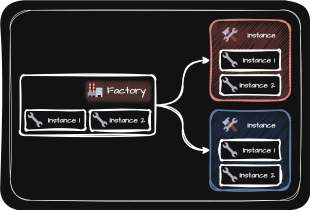

# Abstract Factory (추상 팩토리 패턴)
> [!NOTE]
> 추상 팩토리 패턴은 클래스의 인스턴스를 대신 생성하는 팩토리 메소드 패턴과 유사하지만
> 팩토리 메소드 패턴은 하나의 클래스의 인스턴스만 생성하는 대신
> 추상 팩토리 패턴은 관련된 모든 클래스를 생성한다는 점이 다릅니다.

  

- 장점
  - 추상 팩토리 패턴을 사용하면 서로 관련된 객체들을 일관된 방식으로 생성하고 구체적인 클래스에 의존하지 않도록 하여 유연성과 확장성을 높일 수 있습니다.