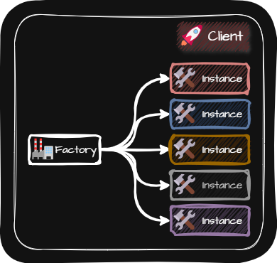

# Factory Method (팩토리 메소드 패턴)
> [!NOTE]
> 팩토리 메소드 패턴은 특정 클래스와 Client 사이에 팩토리라는 중개자를 두는 패턴입니다.  
>   
> 특정 클래스의 인스턴스를 만들고 필요시 특정 방식으로 처리하는 일을 팩토리에 위임하는 것입니다.

  

- 장점
  - 객체의 생성을 팩토리에 위임함으로써 보다 유연하고 확장 가능한 프로그램을 설계할 수 있습니다.