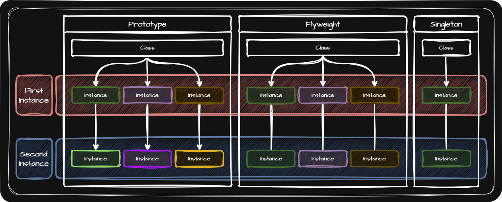

# Flyweight (플라이웨이트 패턴)
> [!NOTE]
> 플라이웨이트 패턴은 특정 객체가 여러 번 또는 여러 곳에서 필요할 때 이를 매번 새로 생성하지 않고 하나를 공유함으로써 메모리를 절약하기 위한 패턴입니다.

  

- 장점
  - 생성된 인스턴스와 동일한 클래스, 필드 값을 가지는 인스턴스가 필요할 경우 컴퓨터의 자원을 보다 효율적으로 사용
  - 같은 객체가 여럿 만들어질 수 있는 상황에서 메모리를 절약하는데 매우 유용하게 사용

- 싱글톤 패턴과 차이점
  - 싱글톤 패턴을 클래스의 인스턴스가 하나인 것을 말함
  - 플라이웨이트 패턴은 팩토리가 제어하며 인스턴스가 여럿 만들어질 수 있습니다.
  - 다만, 플라이웨이트의 각 인스턴스는 메모리를 공유합니다.